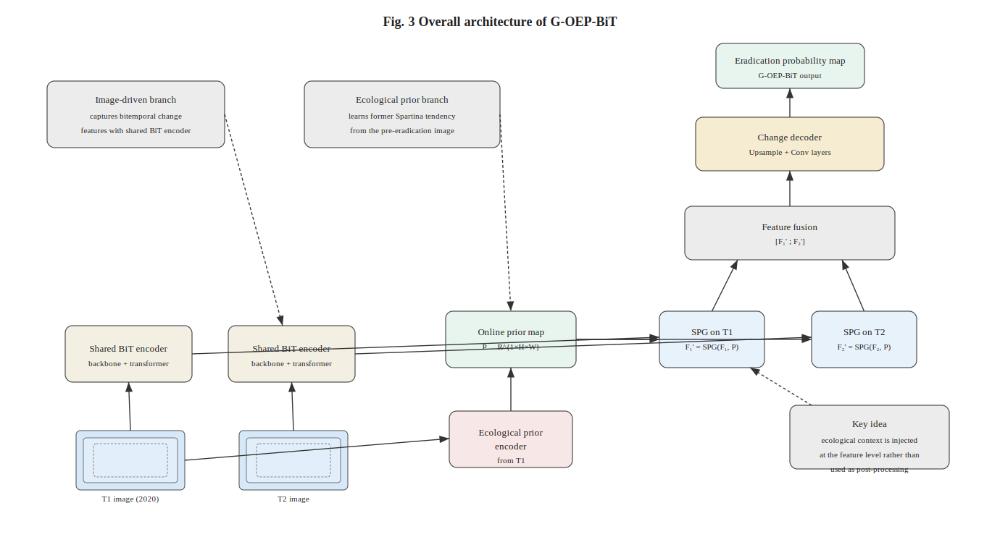
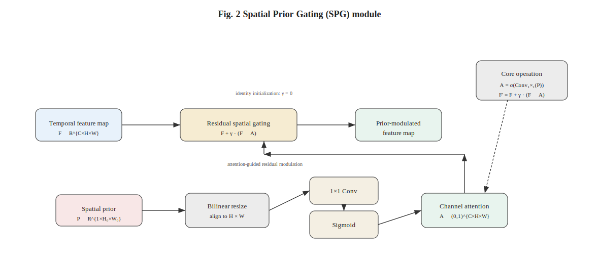
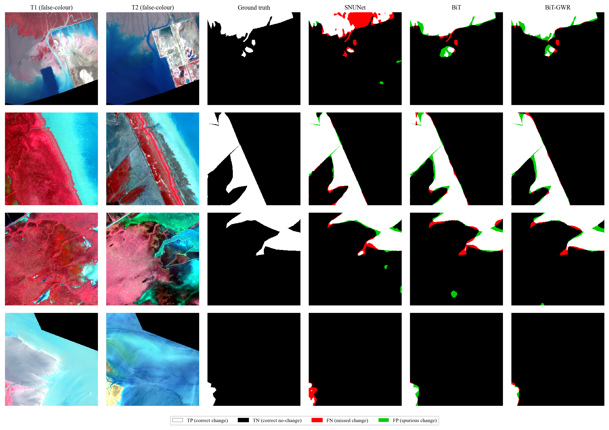
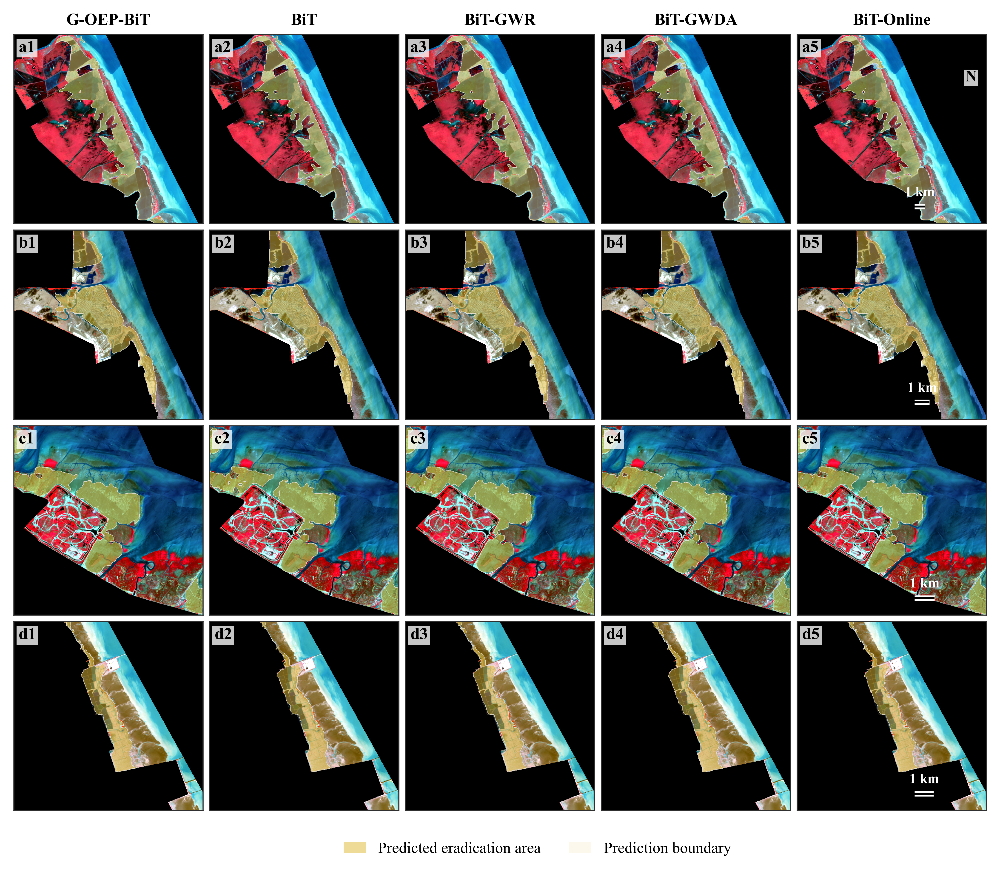
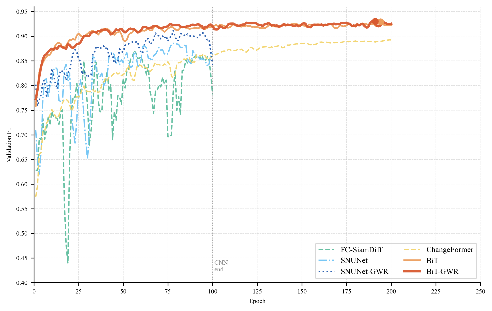
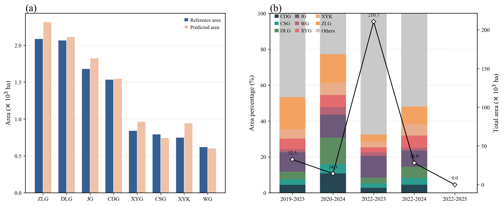

# BiT-GeoPrior

<div align="center">

**Bi-temporal Transformer with Ecologically-informed Geographic Prior for Coastal Wetland Change Detection**

[](https://opensource.org/licenses/MIT)
[](https://www.python.org/downloads/)
[](https://pytorch.org/)

</div>

## Abstract

Accurate monitoring of *Spartina alterniflora* (cordgrass) dynamics in coastal wetlands is critical for ecological conservation, yet remains challenging due to spectral confusion and tidal complexity. We propose **BiT-GeoPrior**, a bi-temporal change detection framework that integrates geographic prior knowledge into deep neural networks via a lightweight, zero-initialized **Spatial Prior Gate (SPG)**. The framework supports both **static priors** (GWR-based local *R*², GWDA posterior probability) and an **online ecological prior encoder** that estimates prior maps end-to-end from satellite imagery—eliminating the need for precomputed auxiliary data.

## Architecture

<div align="center">
  
  <p><em>Overall architecture: Bi-temporal Transformer with Spatial Prior Gate injection.</em></p>
</div>

### Spatial Prior Gate (SPG)

The SPG is a zero-initialized residual attention gate that injects prior knowledge into intermediate feature maps:

<div align="center">
  
  <p><em>SPG: residual channel attention with zero-initialized learnable gain γ. At initialization, the model is strictly equivalent to a prior-free baseline.</em></p>
</div>

$$
\mathbf{F}_{out} = \mathbf{F} + \gamma \cdot (\mathbf{F} \odot \sigma(\text{Conv}_{1\times1}(\mathbf{P})))
$$

Key properties:
- **Identity at initialization** — γ starts at 0, ensuring training begins identically to the baseline
- **Plug-and-play** — can be inserted into any Siamese change detection network
- **Interpretable γ** — the learned gain reveals how strongly the model relies on prior knowledge

## Models

| Model | Prior Type | Description |
|-------|-----------|-------------|
| `SNUNet` | None | Siamese Nested U-Net baseline (ECCV 2020) |
| `SNUNet_GeoAware` | Static | SNUNet + SPG at shallow decoder layers |
| `FCSiamDiff_Aligned` | None | Fully Convolutional Siamese Difference |
| `BiT` | None | Bi-temporal Transformer (ResNet-18 + Transformer Encoder) |
| `BiT_GWR` | Static GWR | BiT + GWR local-*R*² prior |
| `BiT_GWDA` | Static GWDA | BiT + GWDA posterior probability prior |
| `BiT_Online` | **Online** | BiT + learnable ecological prior encoder (no static files) |
| `ChangeFormer` | None | Hierarchical Transformer |

## Results

### Qualitative Comparison

<div align="center">
  
  <p><em>Qualitative comparison across representative coastal wetland scenes. BiT_Online consistently reduces false positives in spectrally ambiguous regions.</em></p>
</div>

### Ablation Study

<div align="center">
  
  <p><em>Ablation results: prior injection consistently improves F1 across all base architectures.</em></p>
</div>

### Training Dynamics

<div align="center">
  
  <p><em>Training and validation curves. Left: loss convergence. Right: F1 progression.</em></p>
</div>

### Estuary Transfer Performance

<div align="center">
  
  <p><em>Spatial transfer across different estuaries demonstrates generalization capability.</em></p>
</div>

## Installation

```bash
git clone https://github.com/yoyu0207/BiT-GeoPrior.git
cd BiT-GeoPrior
pip install -r requirements.txt
```

### Requirements

- Python ≥ 3.10
- PyTorch ≥ 2.0
- torchvision ≥ 0.15

## Dataset Structure

```
data_root/
├── A/                     # T1 Sentinel-2 patches (.npy, [8, H, W])
├── B/                     # T2 Sentinel-2 patches (.npy, [8, H, W])
├── label/                 # Binary change labels (.npy or .png)
├── spatial_prior_gwr/     # (optional) GWR prior patches [0, 1]
└── spatial_prior_gwda/    # (optional) GWDA prior patches [0, 1]
```

8-channel composition: **B8, B4, B3, B2, NDVI, EVI, SAVI, GNDVI**

## Quick Start

### Training

```bash
# Baseline (no prior)
python train.py --model SNUNet --epochs 200
python train.py --model BiT --lr 6e-5 --epochs 200
python train.py --model ChangeFormer --epochs 200

# With static prior (requires spatial_prior_gwr/ or spatial_prior_gwda/)
python train.py --model BiT_GWR --lr 6e-5 --epochs 200
python train.py --model BiT_GWDA --lr 6e-5 --epochs 200

# With online prior (no static files needed)
python train.py --model BiT_Online --lr 6e-5 --epochs 200
```

### Evaluation

```bash
python evaluate.py --model BiT_GWR --pth checkpoints/BiT_GWR/best_model.pth
```

## Project Structure

```
├── models/
│   ├── __init__.py
│   ├── snunet.py                  # SNUNet & SNUNet_GeoAware
│   ├── FC_Siam_diff.py            # FC-Siam-Diff
│   ├── bit.py                     # BiT baseline
│   ├── bit_gwr.py                 # BiT + GWR prior
│   ├── bit_gwda.py                # BiT + GWDA prior
│   ├── bit_online.py              # BiT + online prior
│   ├── changeformer.py            # ChangeFormer
│   ├── SPGmodule.py               # Spatial Prior Gate
│   ├── ecological_prior.py        # Online prior encoder
│   └── transformer_block.py       # Shared Transformer block
├── train.py                       # Training entry point
├── dataset.py                     # Data loader with augmentation
├── losses.py                      # BCE + Dice hybrid loss
├── utils.py                       # Metric tracker (IoU, F1, etc.)
├── evaluate.py                    # Standalone evaluation
├── assets/                        # README figures
├── requirements.txt
├── LICENSE
└── README.md
```

## Citation

```bibtex
@article{...,
  title     = {...},
  author    = {...},
  journal   = {...},
  year      = {2025}
}
```

## License

This project is released under the [MIT License](LICENSE).
